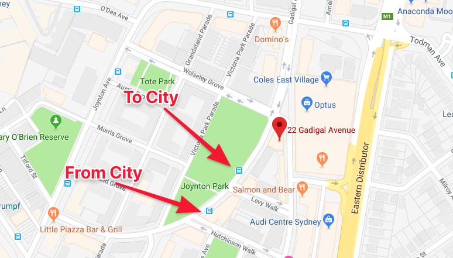

# Getting Around

## The Opal Card

You should get an OPAL card (https://www.opal.com.au) to use the public transport, You can buy one at the newshop at East Village Center, next to the pharmacy.

## The 304 Bus

The best way to get around in Sydney is by bus or by train. The new 304 bus stop is literally across the road from us:

### Bus Schedule

The 304 time schedule can be found on the [Moovit Webpage](https://moovitapp.com/sydney-442/lines/304/7599403/3895122?t=1).

Make sure you use the app [NextThere](https://nextthere.com) for up-to-date bus info.